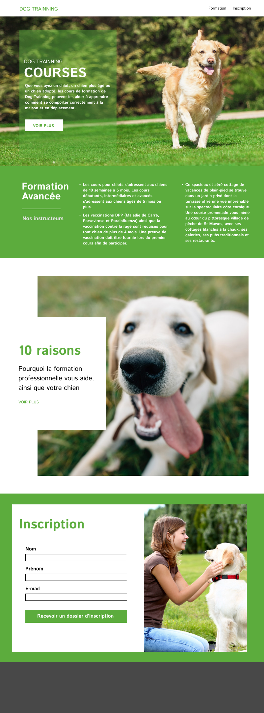

# Dog_trainning

Alex, formateur et dresseur de chiens, souhaite présenter son entreprise de dressage canin en créant son site internet. Il vous sollicite pour le créer. Alex a déjà consulté un web designer et vous remet donc la maquette du site.

## Consigne

Vous allez commencer par créer la structure du site en HTML ainsi que les éléments qui la composent.